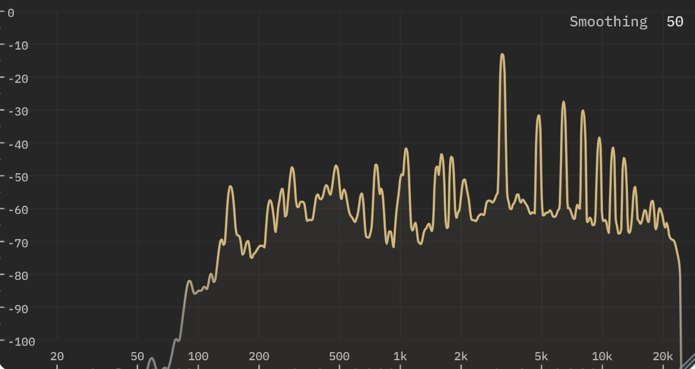

# char-spectrum

A spectrum analyzer plug-in, drawn on the GPU with WebGPU/Dawn.



The plugin shows a log frequency spectrum with a 4.5 dB per octave tilt around 1 kHz. 
Smoothing can be adjusted to have a more or less reactive spectrum.

## Download

| Platform | Formats | Download |
|---|---|---|
| macOS | CLAP, VST3, AU | [char-spectrum-macOS.zip](https://github.com/charCulbert/char-spectrum/releases/latest/download/char-spectrum-macOS.zip) |
| Windows | CLAP, VST3 | [char-spectrum-Windows.zip](https://github.com/charCulbert/char-spectrum/releases/latest/download/char-spectrum-Windows.zip) |
| Linux | CLAP, VST3 | [char-spectrum-Linux.zip](https://github.com/charCulbert/char-spectrum/releases/latest/download/char-spectrum-Linux.zip) |
| Browser hosts | WCLAP | [char-spectrum.wclap.tar.gz](https://github.com/charCulbert/char-spectrum/releases/latest/download/char-spectrum.wclap.tar.gz) |

All releases are on the [releases page](https://github.com/charCulbert/char-spectrum/releases).

## Build

```sh
git clone https://github.com/charCulbert/char-spectrum.git
cd char-spectrum
cmake -B build
cmake --build build
```

That builds CLAP, VST3, AU (macOS) and a standalone app into `build/`. It needs
CMake 3.28 or later and a C++20 compiler; on Linux also `libasound2-dev` and
`libx11-dev`.

WCLAP, for browser hosts, needs the [WASI SDK](https://github.com/WebAssembly/wasi-sdk/releases)
and [Emscripten](https://emscripten.org) (`emcmake` on your `PATH`):

```sh
cmake -B build-wclap -DCMAKE_TOOLCHAIN_FILE=<wasi-sdk>/share/cmake/wasi-sdk-p1.cmake
cmake --build build-wclap
```

To run the tests after building: `ctest --test-dir build`.
